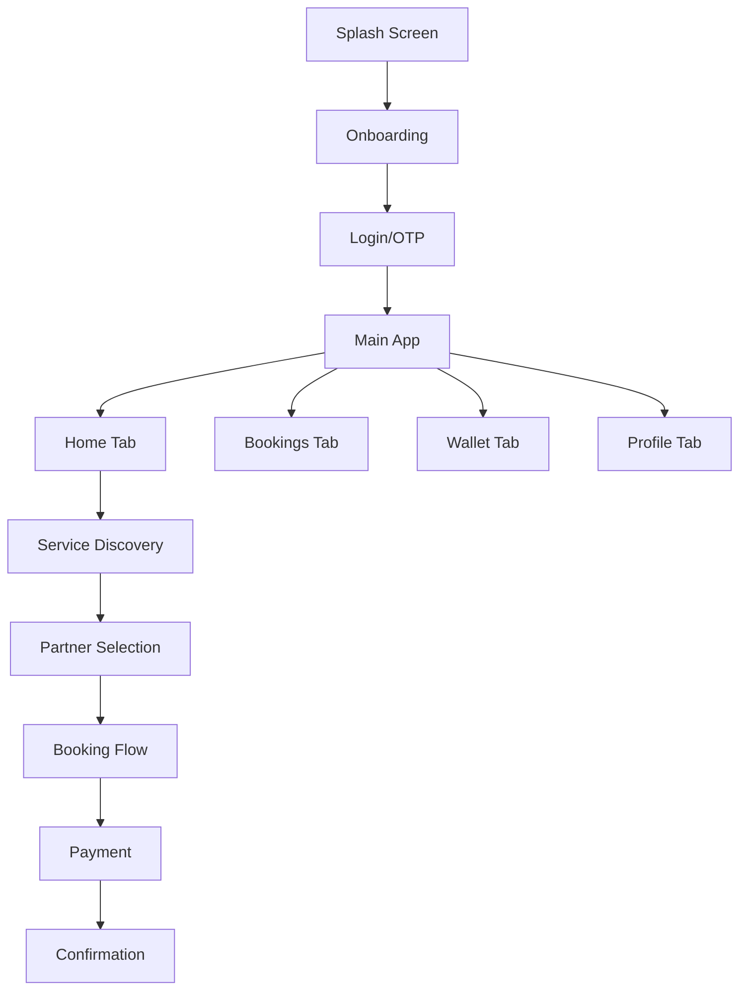

# ⚡ SnapShoot App - Complete Photography & Videography Booking Platform

<p align="center">
  
  
  
  
</p>

> **A modern, feature-rich mobile app that connects users with professional photographers and videographers for all types of events and occasions.**

## 🎯 Overview

SnapShoot is a comprehensive booking platform designed to bridge the gap between users seeking professional photography/videography services and talented service providers. Built with React Native and modern technologies, it offers a seamless experience for discovering, booking, and managing photography sessions.

### 🌟 Key Features

- **📱 Modern UI/UX**: Dark theme with red accents, intuitive navigation
- **🔐 Secure Authentication**: Phone OTP-based login system
- **🎨 Service Discovery**: Browse categories like wedding, corporate, celebrity shoots
- **📅 Smart Booking**: Easy scheduling with real-time availability
- **💳 Digital Wallet**: Integrated payment system with discounts and referrals
- **🤝 Partner Network**: Connect with verified photographers and videographers
- **📍 Location Services**: City-based service availability
- **🎁 Promotions**: Coupon system and loyalty rewards

### 🚀 Enhanced Features (Improvements)

- **💬 Real-time Chat**: Direct communication with service providers
- **🤖 AI Recommendations**: Smart service suggestions
- **📍 Live Tracking**: Real-time photographer location during shoots
- **📊 Analytics Dashboard**: User insights and booking analytics
- **🌐 Multi-language Support**: Localization for different regions
- **📱 Offline Mode**: Core functionality without internet
- **🔗 Social Integration**: Share experiences and reviews

## 🏗️ Technical Architecture

### Frontend Stack
```
📱 React Native (Expo SDK 51+)
├── 🧭 Navigation: React Navigation 6.x
├── 🗃️ State Management: Zustand + React Query
├── 🎨 UI Library: NativeBase + Custom Components
├── ✨ Animations: React Native Reanimated 3
├── 📝 Forms: React Hook Form + Yup
├── 🗺️ Maps: React Native Maps
├── 📷 Camera: Expo Camera + Image Picker
└── 🔔 Notifications: Expo Notifications
```

### Backend Stack
```
🔥 Firebase/Supabase Hybrid
├── 🔐 Authentication: Firebase Auth (Phone OTP)
├── 🗃️ Database: Supabase PostgreSQL
├── 📁 Storage: Supabase Storage
├── ⚡ Real-time: Supabase Realtime
├── 💳 Payments: Stripe + Razorpay
└── 📊 Analytics: Firebase Analytics
```

## 📋 Project Documents

- **[📖 Complete Development Plan](./SNAPSHOOT_APP_DEVELOPMENT_PLAN.md)** - Comprehensive roadmap and feature specifications
- **[📁 Project Structure](./PROJECT_STRUCTURE.md)** - Detailed file organization and architecture
- **[📸 Original Analysis](./snapshoot%20app%20clone-%20info.txt)** - Analysis of the original app screenshots

## 🚀 Quick Start

### Prerequisites

```bash
# Install Node.js (18+)
node --version

# Install Expo CLI
npm install -g @expo/cli

# Install Git
git --version
```

### Setup Instructions

1. **Clone and Initialize**
   ```bash
   # Create new Expo project
   npx create-expo-app SnapShootApp --template expo-template-blank-typescript
   cd SnapShootApp

   # Install dependencies
   npm install
   ```

2. **Install Core Dependencies**
   ```bash
   # Navigation
   npm install @react-navigation/native @react-navigation/bottom-tabs @react-navigation/native-stack

   # UI & Styling
   npm install native-base react-native-svg react-native-safe-area-context

   # State Management
   npm install zustand @tanstack/react-query

   # Forms & Validation
   npm install react-hook-form @hookform/resolvers yup

   # Firebase & Backend
   npm install firebase @supabase/supabase-js

   # Additional utilities
   npm install react-native-mmkv expo-secure-store expo-location
   ```

3. **Configure Environment**
   ```bash
   # Copy environment template
   cp .env.example .env

   # Add your API keys and configuration
   # FIREBASE_API_KEY=your_firebase_key
   # SUPABASE_URL=your_supabase_url
   # SUPABASE_ANON_KEY=your_supabase_key
   ```

4. **Start Development**
   ```bash
   # Start Expo development server
   npx expo start

   # For iOS simulator
   npx expo start --ios

   # For Android emulator
   npx expo start --android
   ```

## 📱 App Flow



## 🎨 Design System

### Color Palette
```css
Primary Red:    #FF0000
Primary Black:  #000000
Dark Gray:      #1A1A1A
Medium Gray:    #404040
Light Gray:     #808080
Success Green:  #10B981
Warning Yellow: #F59E0B
```

### Typography
- **Primary Font**: Inter (system fallback)
- **Heading Font**: Poppins (for emphasis)
- **Sizes**: 12px - 36px scale

### Components
- **Buttons**: Pill-shaped with red fill
- **Cards**: Rounded corners with shadows
- **Navigation**: Custom bottom tab bar
- **Forms**: Dark theme with red accents

## 📊 Development Phases

| Phase | Duration | Focus | Status |
|-------|----------|-------|--------|
| **Phase 1** | Week 1-2 | Foundation & Setup | 🔄 In Progress |
| **Phase 2** | Week 3 | Authentication & Onboarding | ⏳ Pending |
| **Phase 3** | Week 4-5 | Core App Structure | ⏳ Pending |
| **Phase 4** | Week 6-7 | Booking System | ⏳ Pending |
| **Phase 5** | Week 8-9 | Wallet & Payments | ⏳ Pending |
| **Phase 6** | Week 10 | Profile & Settings | ⏳ Pending |
| **Phase 7** | Week 11-12 | Enhanced Features | ⏳ Pending |
| **Phase 8** | Week 13-14 | Testing & Polish | ⏳ Pending |

## 🧪 Testing Strategy

```bash
# Run unit tests
npm test

# Run integration tests  
npm run test:integration

# Run E2E tests
npm run test:e2e

# Generate coverage report
npm run test:coverage
```

## 📈 Performance Targets

- **Cold Start**: < 2 seconds
- **Bundle Size**: < 50MB
- **Memory Usage**: < 200MB peak
- **Search Results**: < 300ms

## 🔐 Security Features

- End-to-end encryption for messaging
- Secure payment processing (PCI DSS)
- Phone OTP authentication
- Data anonymization for analytics
- GDPR compliance ready

## 🌍 Deployment

### Development
```bash
# Build for development
npx expo build:android --type development-client
npx expo build:ios --type development-client
```

### Production
```bash
# Build for production with EAS
npm install -g eas-cli
eas build --platform all
```

### CI/CD Pipeline
- Automated testing on PR
- Staging deployment for testing
- Production deployment with approval
- Performance monitoring

## 🤝 Contributing

1. Fork the repository
2. Create a feature branch (`git checkout -b feature/amazing-feature`)
3. Commit changes (`git commit -m 'Add amazing feature'`)
4. Push to branch (`git push origin feature/amazing-feature`)
5. Open a Pull Request

### Development Guidelines

- Follow TypeScript strict mode
- Use ESLint and Prettier for code formatting
- Write unit tests for new features
- Update documentation for API changes
- Follow conventional commit messages

## 📝 Documentation

- **[API Documentation](./docs/api.md)** - Backend API specifications
- **[Component Library](./docs/components.md)** - UI component documentation
- **[Testing Guide](./docs/testing.md)** - Testing best practices
- **[Deployment Guide](./docs/deployment.md)** - Production deployment steps

## 🐛 Known Issues

- Initial load time optimization needed
- Image caching improvements planned
- Offline mode partial implementation

See [Issues](https://github.com/your-repo/snapshoot-app/issues) for complete list.

## 📄 License

This project is licensed under the MIT License - see the [LICENSE.md](LICENSE.md) file for details.

## 📞 Support

- **Email**: support@snapshoot.com
- **Discord**: [Join our community](https://discord.gg/snapshoot)
- **Documentation**: [docs.snapshoot.com](https://docs.snapshoot.com)

## 🙏 Acknowledgments

- Original SnapShoot app design inspiration
- React Native community
- Expo team for excellent tooling
- Firebase for backend services
- All contributors and beta testers

---

<p align="center">
  <strong>Made with ❤️ by the SnapShoot Team</strong>
</p>

<p align="center">
  
  
  
</p> 